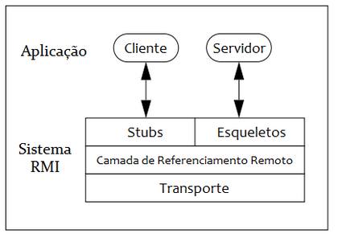

# Servidor de Eventos

### Resumo ###

Este trabalho apresenta um sistema de servidor de eventos desenvolvido no contexto de programação distribuída utilizando o RMI Java. O sistema permite o cadastro de clientes em tópicos de interesse, o envio de eventos relacionados a esses tópicos para um servidor central, que proecessa e notifica os clientes registrados. O uso do RMI Java proporciona uma comunicação transparente entre os componentes distribuídos, permitindo a invocação remota de métodos como se fossem chamados localmente. 

### Arquitetura Utilizada ###

A arquitetura proposta para implementar o servidor de eventos com RMI Java é baseada na abordagem cliente-servidor, em que os clientes se conectam ao servidor para interagir com o sistema. Essa arquitetura pode ser dividida em três módulos: cliente, servidor e interface remota.

A arquitetura pode ser ilustrada a partir da seguinte imagem:

  
   
  <em>Cliente-Servidor</em>

- **Módulo Cliente:** Este módulo é responsável por permitir que os clientes interajam com o servidor. Os clientes podem se cadastrar em tópicos de interesse, enviar eventos relacionados a esses tópicos e receber notificações do servidor quando novos eventos relevantes forem recebidos.

- **Módulo Servidor:** Este módulo é o componente central do sistema, responsável por receber eventos, processá-los e notificar os clientes registrados que têm interesse nos tópicos dos eventos recebidos.

- **Interface Remota:** A interface remota é a interface Java que define os métodos que podem ser invocados remotamente pelos clientes no servidor.

